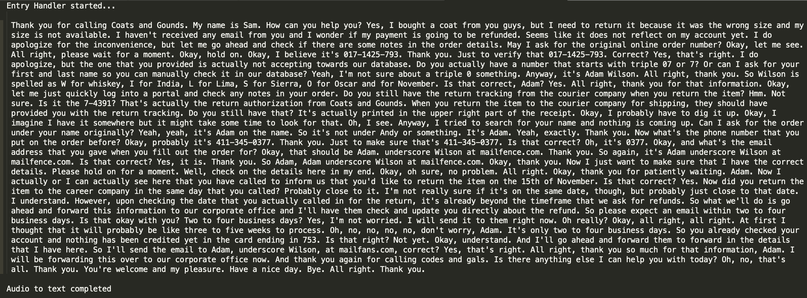
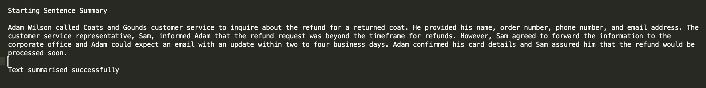
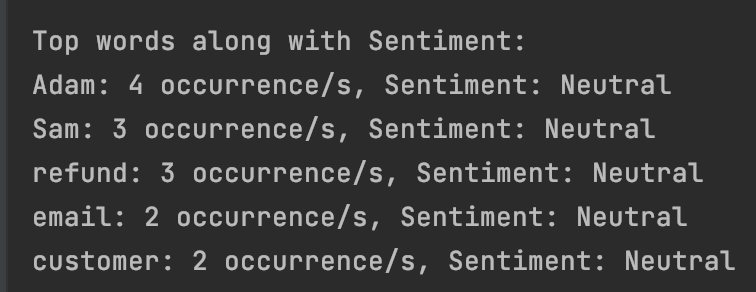
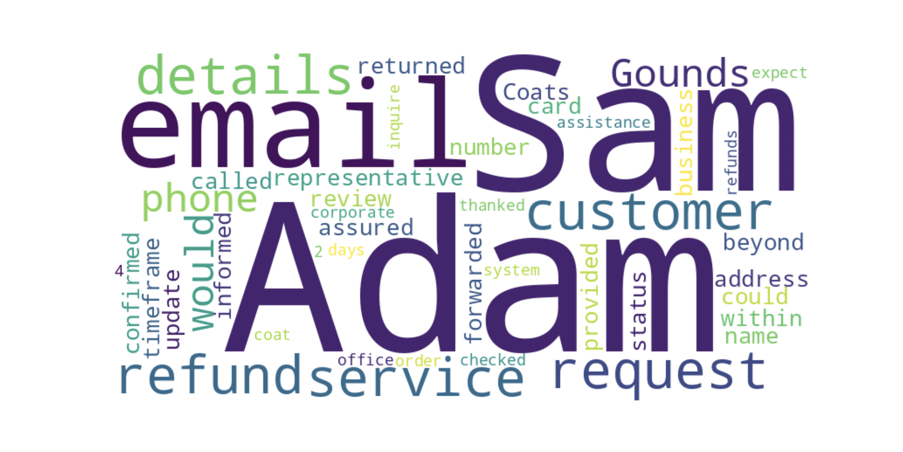
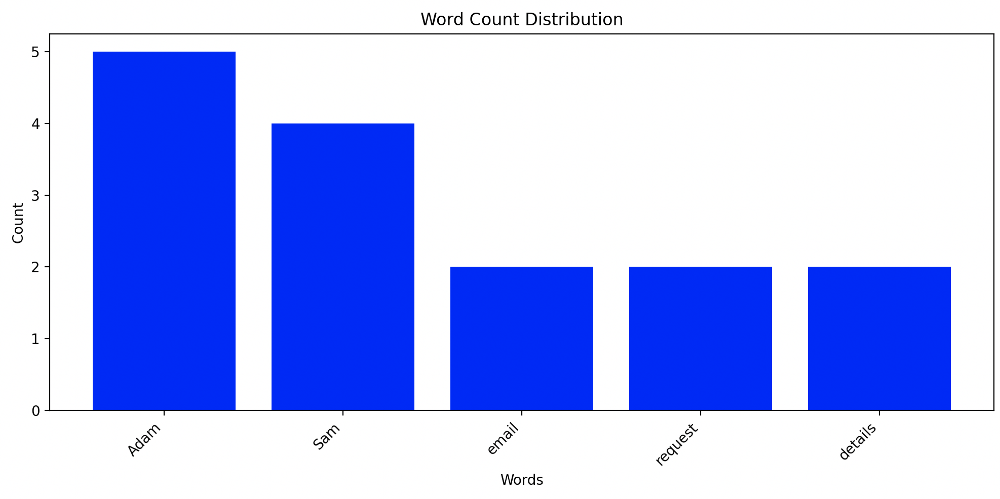
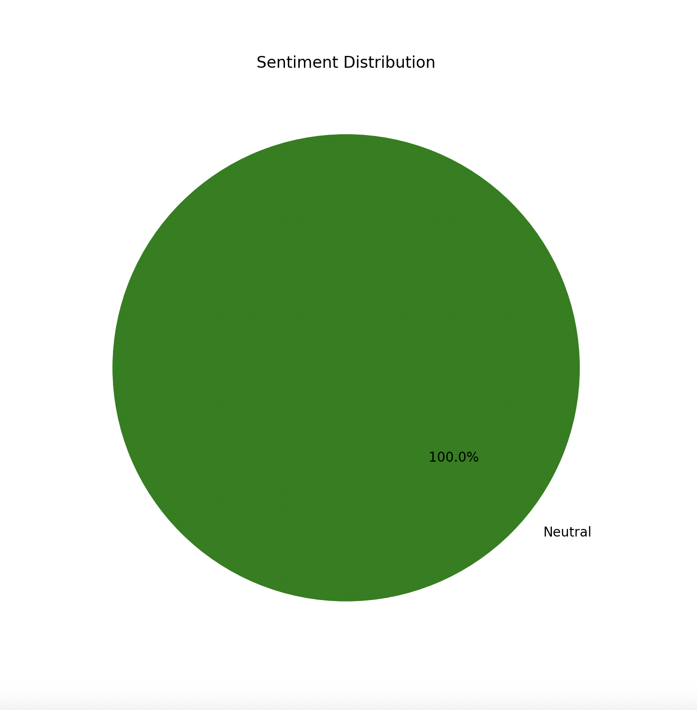

# CustomerEchoEase

## Problem Statement

Customer Support Executives often spend substantial time summarizing and documenting customer interactions post calls, adding an extra burden to their workflow. After each call, they manually input the customer's concerns into systems for further analysis by support teams and managers.

## Aim:
Consider an executive who spends 15 minutes summarizing each of the 8 calls they attend daily. This totals an additional 2 hours spent on summarization, time that could have been used to handle 2-3 more customer requests. The aim of CustomerEchoEase is to enhance customer support efficiency, freeing up valuable time for executives to focus on tasks that truly matter.


## Overview

The Customer Echo Ease utility (A Generative AI based utility) is designed to fast-track the Time-To-Resolution (TAT) for customer care executives and support teams. By processing monologue/dialogue-based audio files (typically customer requests, complaints, or feedback) in WAV or MP3 format, this utility provides valuable insights to enhance customer support operations.

## Project Demo

Watch a brief [demo](http://www.youtube.com/watch?v=3sXMmNe41uk) of the project for a quick glimpse:

[](http://www.youtube.com/watch?v=3sXMmNe41uk)

You can also find at : 

https://pypi.org/project/AudioSummariser/

## Features

1. **Text Summarization:** Quickly generates a summarized text from audio files, enabling faster Call-to-Action (CTA) and issue resolution.

2. **Sentiment Analysis:** Evaluates the sentiment of the customer during the call, providing a better understanding of the overall conversation tone.

3. **Fine-grained Sentiment Analysis:** Conducts sentiment analysis on a word-by-word basis, providing detailed insights into the sentiment of each word used in the conversation.

4. **Noise Reduction Techniques:** Implements advanced methods, including stopwords removal and tokenization, to enhance the accuracy and meaningfulness of the results by eliminating unnecessary noise from the text.

5. **Word Clouds:** Visualizes the most frequently used words in the conversation through appealing word clouds.

6. **Top 5 Words Bar Graphs:** Presents a bar chart showcasing the top 5 most frequently used words, aiding in identifying key themes.

7. **Overall Sentiment Pie Chart:** Represents the overall sentiment distribution of the conversation in the form of a pie chart.


## How It Works

1. **Audio Input:** Upload the audio file in WAV or MP3 format containing customer interactions.

2. **Text Summarization:** The utility processes the audio content and generates a concise text summary.

3. **Sentiment Analysis:** Analyzes the sentiment of the customer during the call (Positive, Negative, or Neutral).
 
4. **Word Clouds:** Creates visually appealing word clouds depicting the most used words in the conversation.

5. **Graphs and Charts:** Displays bar graphs for the top 5 most used words and a pie chart for overall sentiment distribution.


## Getting Started

1. Fork the repository [here](https://github.com/hardik-goel/Audio-Summariser/fork)


2. Clone the forked repository:
   ```
   git clone https://github.com/<YOUR-USERNAME>/Audio-Summariser.git
   cd Audio-Summariser
   ```
   
3. Create a Python Virtual Environment:
   

   - Using [virtualenv](https://learnpython.com/blog/how-to-use-virtualenv-python/):
     
      Note: Check how to install virtualenv on your system [here](https://learnpython.com/blog/how-to-use-virtualenv-python/)

      OR

   - Create a Python Virtual Environment:
   ```
   python -m venv env
   ```
4. Activate the Virtual Environment.

   - On Windows:
      ```
     env\Scripts\activate
     ```
   - On macOS and Linux:
     ```
     source env/bin/activate
     ```
   
5. **Install Dependencies:**
    ```bash
    pip install -r requirements/requirements.txt
    ```
   You can also use :

   ```
   pip install AudioSummariser==0.1.0
   ```
   
6. **Prepare Data:**
    Place your .wav files under `data/` folder.
    Please ensure that no other file is kept under `data/` folder.
   

7. **Usage:**
    ```
    python main/entry_handler.py
    ```
   
    **Models used:**
   
    - OpenAI's whisper for Audio to Text Conversion
    - Gemini-Pro for Text Summarisation.
      [Tried GPT-3.5, Bart-large-cnn, bart-base but the accuracy received is most in gemini-pro]


## Screenshots













Note - For some of the systems, installing Openai's whisper directly might not work.
Use :        

      "git+https://github.com/openai/whisper.git"


### Contributor:

- This project was developed to improve the efficiency of customer support teams by [Hardik Goel](https://www.linkedin.com/in/hardik-goel-a6334936/).


<table>
    <tr>
        <td align="center">
            <a href="https://www.linkedin.com/in/hardik-goel-a6334936/">
                
                <br />
                <sub><b>Hardik Goel</b></sub>
            </a>
        </td>
    </tr>
</table>


Feel free to contribute or report issues!

https://www.buymeacoffee.com/hardikgoel